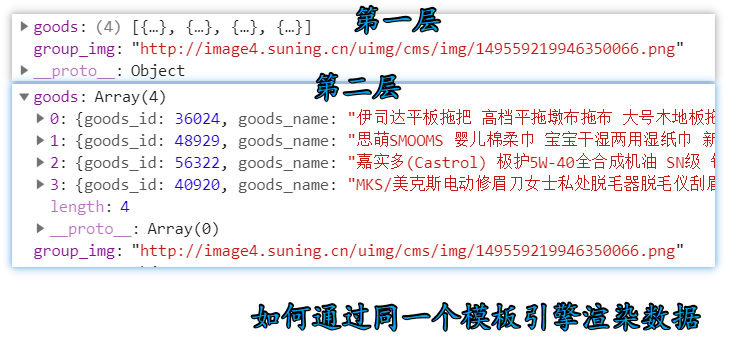
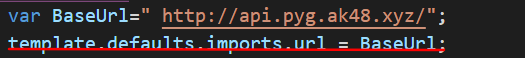
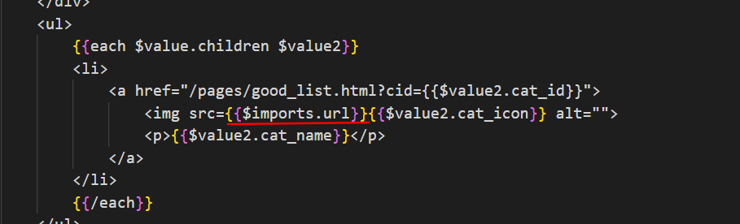
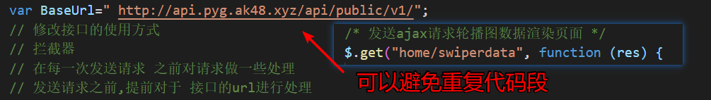

<<<<<<< HEAD
# 阿里百秀项目

目录：

[1  模板引擎的使用](#1--模板引擎的使用)

[2  pagination-plugin分页插件介绍](#2--pagination-plugin分页插件介绍)

[3  layer组件介绍](#3--layer组件介绍)

[4  用时间插件laydate来完成文章添加的时间显示](#用时间插件laydate来完成文章添加的时间显示)

[5  集成富文本编辑器到文章添加内容中](#5--用时间插件laydate来完成文章添加的时间显示)

> where="1=1"--组装where查询条件  

-  where = '1=1' 条件永远为真，当后面没有and拼接条件的时候，sql就这样 ：select*from posts where

-  where后面没有条件就会报错，where后面拼接1=1,就避免这种错，这种语句一般用在搜索中，主要防止查询条件报错

```sql
$where = "1+1";//用于拼接查询条件
    if ( $cat_id != 'all' ) {
        $where .= " and t1.cat_id = $cat_id ";
    }
    if ( $status != 'all' ) {
        $where .= " and t1.status = '$status'";
    }

     //2、编写sql语句查询所需数据
    $where = '1=1';//用于拼接查询条件
    if ( $cat_id != 'all' ) {
        $where .= " and t1.cat_id = $cat_id ";
    }
    if ( $status != 'all' ) {
        $where .= " and t1.status = '$status'";
    }


     //2、编写sql语句查询所需数据
    $sql = "SELECT
     t1.*,t2.nickname,t3.cat_name
    FROM
     posts t1
    LEFT JOIN users t2
    on
     t1.user_id = t2.user_id
    LEFT JOIN category t3
    ON
     t1.cat_id = t3.cat_id
    WHERE $where
    ORDER BY t1.post_id DESC
    LIMIT $offset,$pagesize";

     //3、执行sql语句
     $data = read($sql,"bx");

     //4、定义sql语句获取文章总数,算出分页码数
     $sql2 = "SELECT count(*) postsCount FROM posts t1 WHERE $where";
```

## 1  模板引擎的使用

> 1、预备知识点：  

### script标签的特点是：
- innerHTML 永远不会显示在界面上
- 如果 type 不等于 text/javascript 的话，内部的内容不会作为 javascript执行

>选择一个模板引擎

[推荐]https://github.com/tj/consolidate.js#supported-template-engines

> 2、下载模板引擎JS文件  


template-web.js

>3、引入到页面

```js
<script src="/static/assets/vendors/art-template/template-web.js"></script>
```

>4、准备一个模板 (联系script标签的特点)

```js
<!-- 准备一个模板引擎 -->
  <script type="text/template" id="tmpl">
    {{each comments}}
    <tr>
      <td class="text-center"><input type="checkbox" value="{{$value["post_id"]}}"></td>
      <td>{{$value["title"]}}</td>
      <td>{{$value["nickname"]}}</td>
      <td>{{$value["cat_name"]}}</td>
      <td class="text-center">{{$value["created"]}}</td>
      <td class="text-center">{{$value["status"]}}</td>
      <td class="text-center">
        <a href="javascript:;" class="btn btn-default btn-xs">编辑</a>
        <a href="javascript:;" class="btn btn-danger btn-xs">删除</a>
      </td>
    </tr>
    {{/each}}
  </script>
```

  > 5、准备一个数据

  ```js
   $.ajax({
    dataType:"json",
    type:"get",
    url:"../api/getPosts.php",
    data:{
      cat_id:cat_id,
      status:status
    },
    success:function(res){
      if (res.code == 200) {
        console.log("请学会给自己找麻烦");
        var data = res.data;
        //调用模板引擎渲染数据
        var context = {comments:data}
        //借助模板引擎的api
        var html = template('tmpl',context);
        //将渲染结果的html设置到默认元素的innerHTML中
        $("tbody").html(html);
        // 重新绘制分页导航
        pageList(res.pageCount);
      }
    },
    error:function(){
      console.log("失败");
    },
    complete:function(){}
  });
  });
  ```

  > 6、通过模板引擎的js提供大的一个api将模板整合得到渲染结果HTML

  ```js
  //调用模板引擎渲染数据
  var context = {comments:data}
  //借助模板引擎的api
  var html = template('tmpl',context);
  ```

 >将渲染结果的HTML设置到默认元素的html中

 ```js
 //将渲染结果的html设置到默认元素的innerHTML中
          $("tbody").html(html);
 ```

> **补充1、** 模板引擎中的if语句

```js
 <td class="text-center">
  {{ if $value["status"] == 'drafted'}}
    草稿
    {{ else if $value["status"] == 'piblished' }}
      已发布
    {{ else }}
      已作废
  {{ /if }}
 </td>
```

> **补充2、** 模板引擎不需要循环遍历下的情况


- 服务端返回数据格式
```php
//执行sql语句
$data = read($sql,"bx");

//判断是否查询成功
if ($data) {
    $response = ['code'=>200,'message'=>'提取成功','data'=>$data];
} else {
    $response = ['code'=>-1,'message'=>'提取失败'];
}

echo json_encode($response);
```

- 客户端获取响应数据

```js
$.ajax({
  dataType:"json",
  type:"get",
  data:{page:page},
  url:"../api/getComments.php",
  success:function(res){
    console.log(res);
    //模板所需数据
    var context = {comments:res.data}
    //借助模板引擎的api
    var html = template('tmpl',context);
    console.log(html);
    //将渲染结果的HTML设置到默认元素的 innerHTML 中
    $("tbody").html(html);

    //绘制分页导航
    $('#pagination-demo').twbsPagination({
      totalPages: 10,//分页页码的总页数
      visiblePages: 7,//展示的页码数
      initiateStartPageClick:false, // 取消默认初始点击
      onPageClick: function (event, page) {
        getComments(page);
      }
});
```

- **重点:** 准备模板
```js
<script src="/static/plugins/jquery.twbsPagination.min.js"></script>
<script type="text/x-art-template" id="tmpl">
  {{each comments}}
  <tr>
    <td class="text-center"><input type="checkbox"></td>
    <td>{{$value.author}}</td>
    <td>{{$value.content}}</td>
    <td>{{$value.title}}</td>
    <td>{{$value.created}}</td>
    <td>{{$value.status}}</td>
    <td class="text-center">
      <a href="post-add.php" class="btn btn-info btn-xs">批准</a>
      <a href="javascript:;" class="btn btn-danger btn-xs">删除</a>
    </td>
  </tr>
  {{/each}}
</script>
```

> 补充2  模板引擎中针对返回数据嵌套多层的问题



```html
<!-- 商品列表部分开始 -->
<div class="shop_list">
    <!-- 准备一个模板引擎 -->
    <script type="text/x-art-template" id="tmpl">
    {{each comments}}
    <div class="good_group">
         <div class="list_title">
              
         </div>
         <div class="list_content">
          	<ul>
            {{each $value.goods $value2}}
            	<li>
                   <!-- 商品链接 -->
                   <a href="javascript:;">
                       
                       <p>{{$value2.goods_name}}</p>
                       <i>￥{{$value2.goods_price}}</i>
                   </a>
             {{/each}}
              </ul>
	</script>
     </div>
<!-- 商品列表部分结束 -->
```

### 1.2  模板引擎中的变量

#### 1.2.1  定义变量

`template.defaults.imports // 定义变量`



#### 1.2.2  使用变量

`{{$imports.url}}//变量使用`



## 2  Pagination plugin(分页插件介绍)

> 1、推荐插件下载网址                                    

[ajax分页插件的网址](http://esimakin.github.io/twbs-pagination/)

> 2、进行下载下来，引入下面的js文件：jquery.twbsPagination.js

> 3、放入到项目位置中去

> 4、HTML code

```html
<ul id="pagination-demo" class="pagination-sm pull-right pagination"></ul>
```
> 5、JS code

```js
$('#pagination-demo').twbsPagination({
  totalPages: pageCount,//分页页码的总页数
  visiblePages: 7,//展示的页码数
  initiateStartPageClick:false, // 取消默认初始点击
  onPageClick: function (event, page) {
      // $('#page-content').text('Page ' + page);
  }
});
```

> 6、**项目中要注意的的点**

- **重置分页页码，要重新渲染筛选条件后的分页页码,对page进行解绑事件**
- **因为只需要初始化一次**
```js
//重置分页页码，要重新渲染筛选条件后的分页页码,对page进行解绑事件
  $("#pagination-demo").empty();
  //删除此插件自带的一个值
  $("#pagination-demo").removeData('twbs-pagination');
  //解绑page事件
  $("#pagination-demo").unbind('page');
```

## 3  layer组件介绍

**简单介绍**：ayer是一款近年来备受青睐的web弹层组件，她具备全方位的解决方案，致力于服务各水平段的开发人员，您的页面会轻松地拥有丰富友好的操作体验。

[网址推荐](http://www.layui.com/laydate/)

> 1、步骤：下载插件,引入 layer文件夹 到文件目录


> 2、引入 css 和 js 文件
```html
<link rel="stylesheet" href="/static/plugins/layer/theme/default/layer.css">

<!-- 引入好layer.js后，直接用即可 -->
<script src="/static/plugins/layer/layer.js"></script>
```

> 3、初始化
```js
$(function(){
  $(document)
  .ajaxStart(function(){
  //   // console.log("ajax开始");
  //   layer.load(0, {shade: false}); //0代表加载的风格，支持0-2
  // })
  //loading层
    layer.load(1, {
      shade: [0.3,'#ccc'] ,//0.1透明度的白色背景
      shadeClose :false
    });
  })
  .ajaxStop(function(){
    layer.closeAll(); //关闭特定层
  });
});
```

> 基本参数

#### 3.1  shadeClose - 是否点击遮罩关闭
*类型：Boolean，默认：false*

*如果你的shade是存在的，那么你可以设定shadeClose来控制点击弹层外区域关闭。*

#### 3.2  time - 自动关闭所需毫秒
类型：Number，默认：0

默认不会自动关闭。当你想自动关闭时，可以time: 5000，即代表5秒后自动关闭，注意单位是毫秒（1秒=1000毫秒）

## 4  实现文章图片上传的实时预览

> 使用ajax来上传的条件

- 给 input type=file 文件上传域，绑定 onchange 事件

- 利用表单对象
```js
var formObj = new FormData();
formObj.append('file',文件对象（FILE）); // FILES=> this.files[0]
```

>  FormData对象用以将数据编译成键值对，以便用`XMLHttpRequest`来发送数据。其主要用于发送表单数据

- 只能使用$.ajax，因为可以上传二进制数据
```js
if (file) {
  //有文件上传，发送ajax请求，通过php帮助我们处理上传文件
  $.ajax({
    url: "../api/uploadImg.php",
    type: "post", //上传文件只能是post
    data: formdata,
    contentType: false, //上传文件不可以指定数据类型
    processData: false, //对数据不进行数据的序列化
    dataType: "json",
    success: function (res) {
      if (res.code == 200) {
        $(".help-block").show().attr("src", res.url);
        url = res.url;
      }
    }
  });
}
```

> 服务器端代码

```php
<?php
// var_dump($_FILES);
/* array(1) {
    ["file"]=>
    array(5) {
      ["name"]=>
      string(16) "1454414215-0.png"
      ["type"]=>
      string(9) "image/png"
      ["tmp_name"]=>
      string(22) "C:\Windows\phpBF3C.tmp"
      ["error"]=>
      int(0)
      ["size"]=>
      int(74547)
    }
  } */
  //获取文件后缀名
  $name = $_FILES["file"]["name"];
  $fileSuffix = strrchr($name,".");

  //给文件随机生成一个名字
  $fileNewName = time().rand(0,999).$fileSuffix;

  //获取临时文件地址
  $temp_name = $_FILES["file"]["tmp_name"];

  //当前文件在指定文件夹中的路径
  $fileCurrPath = "../static/assets/img/".$fileNewName;

  //将临时文件存储到指定文件
  if(move_uploaded_file($temp_name,$fileCurrPath)){
    //上传成功，需要返回文件的完整路径
    $response = ['code'=>200,'message'=>'上传头像成功','url'=>$fileCurrPath];
  }else {
    //上传头像失败
    $response = ['code'=>-1,'message'=>'上传头像失败'];
  }
  echo json_encode($response);  
?>
```

## 5  用时间插件laydate来完成文章添加的时间显示

> 网址 [推荐网址](http://www.layui.com/laydate/ )


> 具体使用

**步骤一：** 下载插件，引入laydate目录到项目中
> 获得 layDate 文件包后，解压并将 laydate 整个文件夹（不要拆分结构） 存放到你项目的任意目录，使用时，只需引入 laydate.js 即可。 下面是一个入门示例：


**步骤二：** 引入核心js文件 laydate/laydate.js 文件

```html
<script src="/static/plugins/laydate/laydate.js"></script>
```

**步骤三：** 给时间的input框定义一个id
```html
<div class="form-group">
  <label for="created">发布时间</label>
  <input id="created" class="form-control" name="created">
</div>
```

**步骤四：** 进行时间的初始化

```js
<script>
  //执行一个laydate实例
  laydate.render({
    elem: '#created', //指定元素
    type:'datetime' //指定日期的类型
  });
</script>
```

**效果**


## 5  集成富文本编辑器到文章添加内容中

**步骤一：** 引入富文本编辑器包到项目中

**步骤二：** 引入三个js文件

```js
<script src="/static/plugins/ueditor/ueditor.config.js"></script>
<script src="/static/plugins/ueditor/ueditor.all.min.js"></script>
<script src="/static/plugins/ueditor/lang/zh-cn/zh-cn.js"></script>
<!-- 建议手动加载语言，避免在ie下有时因为加载语言失败导致编辑器加载失败 -->
<!-- 这里加载的语言文本会覆盖在你的配置项目里添加的语言类型，比如比在配置项目里配置的是英文，这里加载的中文，那最后就是中文 -->
```
> 其中 unditor.config.js 是配置文件，如可以改编辑器的宽高和显示编辑器的按钮选项


**步骤三：** 找到页面上的textarea元素，指定id，进行初始化
```js
//初始化富文本编辑器
//实例化编辑器
//建议使用工厂方法getEditor创建和引用编辑器实例，如果在某个闭包下引用改编辑器
var ue = UE.getEditor('content');
```

**效果** 


> 使用富文本编辑的文章样式，到时候在前台显示就会出现对应的样式。（即所见即所得）

**回显富文本编辑器内容注意事项**
```js
//初始化富文本编辑器
//实例化编辑器
//建议使用工厂方法getEditor创建和引用编辑器实例，如果在某个闭包下引用改编辑器
var ue = UE.getEditor('content');//由于异步的原因（时间差的问题--》导致代码的执行顺序）
$("#content").val(data.content); // 后设置内容（可以和上面的代码置换顺序也行）----------记得笔记
```
> 完整代码如下
```js
$.ajax({
  dataType:"json",
  type:"get",
  url:"../api/getOnePostData.php",
  data:{
    post_id:post_id
  },
  success:function(res){
    if (res.code == 200) {
      //把数据赋值给页面对应的input框
      var data = res.data;
      console.log(res.data);
      $("#title").val(data.title);
      $(".help-block").show().attr('src',data.feature);
      $("#created").val(data.created);
      //select对象.val(3); 把option value=3的默认选中
      $("#cat_id").val(data.cat_id);
      $("#status").val(data.status);
      $("#img").val(data.feature);
      //回显富文本编辑器内容
      //初始化富文本编辑器
      //实例化编辑器
      //建议使用工厂方法getEditor创建和引用编辑器实例，如果在某个闭包下引用改编辑器
      var ue = UE.getEditor('content');//由于异步的原因（时间差的问题--》导致代码的执行顺序）
      $("#content").val(data.content); // 后设置内容（可以和上面的代码置换顺序也行）----------记得笔记
    }
  },
  error:function(){
    console.log("失败");
  }
}); 
```


=======
# 项目介绍

目录

[1  项目背景](#1--项目背景)

[2  架构介绍](#2--架构介绍)

[3  技术在线](#3--技术在线)

[4  技术详解](#4--技术详解)

- [4.1  mui轮播图](#41--mui轮播图)
- [4.2  代码优化之--拦截器](#42--代码优化之--拦截器)
- [4.3  模板引擎](https://github.com/BryantOut/bx#1--%E6%A8%A1%E6%9D%BF%E5%BC%95%E6%93%8E%E7%9A%84%E4%BD%BF%E7%94%A8)

## 1  项目背景

​	品优购网上商城是一个综合性的**B2B2C**平台，类似京东商城，

天猫商城。网站采用商家入驻的模式，商家入驻平台提交申请，有平台资质审核，审核过后，商家拥有独立管理后台，录入商品信息。商品经过平台审核后即可发布。

​	品优购网上商城主要分为网站前台，运营商、商家管理后台三个子系统。

> **B2B2C**

​	B2B2C是一种电子商务类型的[网络购物](https://baike.baidu.com/item/%E7%BD%91%E7%BB%9C%E8%B4%AD%E7%89%A9/1521810)商业模式，B是BUSINESS的简称，C是CUSTOMER的简称，第一个B指的是商品或服务的供应商，第二个B指的是从事电子商务的企业，C则是表示消费者。

## 2  架构介绍

​	目前企业中开发的项目，大部分是使用前后端分离的架构。

如图：


## 3  技术在线


​	可能需要用得到的网站

| 名称           | 网址                                       | 备注          |
| ------------ | ---------------------------------------- | ----------- |
| zepto        | http://www.css88.com/doc/zeptojs_api/    | zepto的中文api |
| art-template | http://aui.github.io/art-template/zh-cn/docs/ | 模版引擎        |
| fontawesome  | http://fontawesome.dashgame.com/         | 字体图标        |
| mui官网        | http://dev.dcloud.net.cn/mui/            | 官方网站        |
| hello-mui    | http://www.dcloud.io/hellomui/           | 在线案例        |
| mui-辅助类      | http://www.mubrand.com/?post=19          | mui的辅助类     |
| 品优购在线        | http://pyg.ak48.xyz/                     | 上课参照的案例     |
| 上课源代码        | https://gitee.com/ukSir/gz20-pyg.git     | 上课的源代码的地址   |
| api接口文档      | [api.md](api.md)                         |             |

## 4  技术详解

### 4.1  mui轮播图

> 轮播图如果是动态生成，则需要在渲染完毕之后，手动执行初始化。


**html代码**

```html
<!-- 轮播图部分开始 -->
<div class="mui-slider">
  <div class="mui-slider-group mui-slider-loop">
    <!--支持循环，需要重复图片节点-->
    <div class="mui-slider-item mui-slider-item-duplicate"><a href="#"></a>	  </div>
    <div class="mui-slider-item"><a href="#"></a></div>
    <div class="mui-slider-item"><a href="#"></a></div>
    <div class="mui-slider-item"><a href="#"></a></div>
    <div class="mui-slider-item"><a href="#"></a></div>
    <!--支持循环，需要重复图片节点-->
    <div class="mui-slider-item mui-slider-item-duplicate"><a href="#"></a>	  </div>
  </div>
</div>
<!-- 轮播图部分结束 -->
```


**js代码**

```js
//获得slider插件对象
var gallery = mui('.mui-slider');
gallery.slider({
  interval:5000//自动轮播周期，若为0则不自动播放，默认为0；
});
```


### 4.2  代码优化之--拦截器


**js代码**

```js
$(function () {
    var BaseUrl=" http://api.pyg.ak48.xyz/api/public/v1/";
    // 修改接口的使用方式
    // 拦截器
    // 在每一次发送请求 之前对请求做一些处理 
    // 发送请求之前,提前对于 接口的url进行处理 
    // var oobj={};
    // $.ajax(oobj);
    // http://api.pyg.ak48.xyz/api/public/v1/  +   home/swiperdata
    $.ajaxSettings.beforeSend=function (xhr,obj) {
      obj.url=BaseUrl+ obj.url;
    }
})
```




### 4.3  模板引擎

[模板引擎笔记地址](https://github.com/BryantOut/bx#1--%E6%A8%A1%E6%9D%BF%E5%BC%95%E6%93%8E%E7%9A%84%E4%BD%BF%E7%94%A8)
>>>>>>> cfba18e063e827249057756f45ccafc9a22cf105

